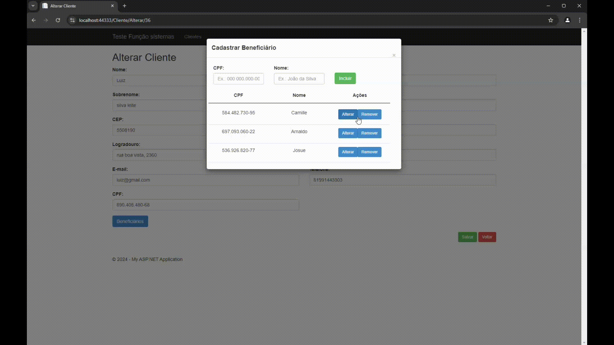

# Teste para Vaga de Pleno Full Stack

Bem-vindo ao repositório deste teste desenvolvido para a vaga de pleno full stack na função sistemas. Este projeto foi construído para demonstrar habilidades em .NET Framework 4.8, JavaScript, Bootstrap e C#. 

## Visão Geral

Este projeto é uma aplicação web que permite o cadastro de clientes e beneficiários, onde os beneficiários estão vinculados aos clientes. A principal meta foi validar o CPF dos usuários, tanto em termos de formato quanto de soma. O projeto utiliza controllers, models e procedures para garantir uma validação eficaz e uma experiência de usuário sólida.

### Principais Funcionalidades

- **Cadastro de Clientes**: Permite adicionar e gerenciar informações dos clientes.
- **Cadastro de Beneficiários**: Vincula beneficiários aos clientes existentes.
- **Validação de CPF**: Verifica o formato e a soma do CPF dos usuários cadastrados.

## Demonstração

Para uma visualização rápida do projeto, você pode assistir aos vídeos abaixo. Eles mostram uma demonstração das principais funcionalidades e como utilizar o aplicativo.




## Como Executar o Projeto

1. Clone este repositório para sua máquina local:
    ```bash
    git clone https://github.com/usuario/nome-do-repositorio.git
    ```

2. Navegue até o diretório do projeto:
    ```bash
    cd nome-do-repositorio
    ```

3. Configure o ambiente .NET Framework 4.8 e as dependências necessárias.

4. Execute o projeto no IIS Express ou na sua IDE de preferência.