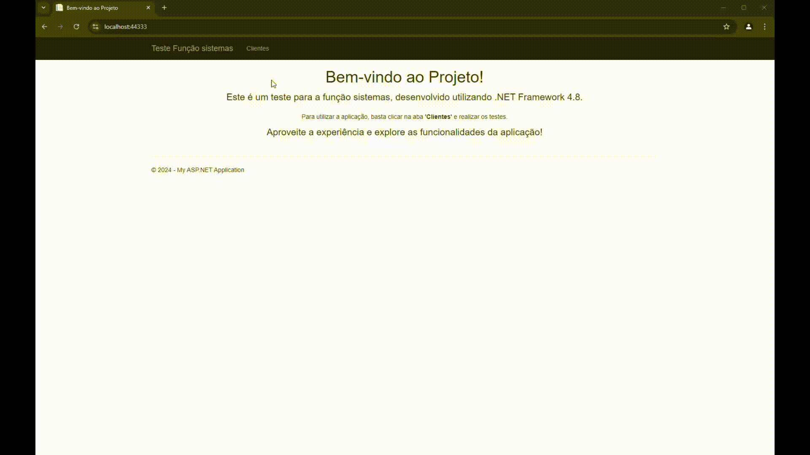

# Meu Projeto

Bem-vindo ao repositório do meu projeto! Este é um breve resumo sobre o que o projeto faz e como você pode utilizá-lo.

## Visão Geral

Este projeto é um [descrição breve do seu projeto]. Ele foi desenvolvido para [objetivo do projeto] e inclui [principais funcionalidades ou características].

## Demonstração

Para uma visualização rápida do projeto, você pode assistir ao vídeo abaixo. Ele mostra uma demonstração das principais funcionalidades e como utilizar o aplicativo.

